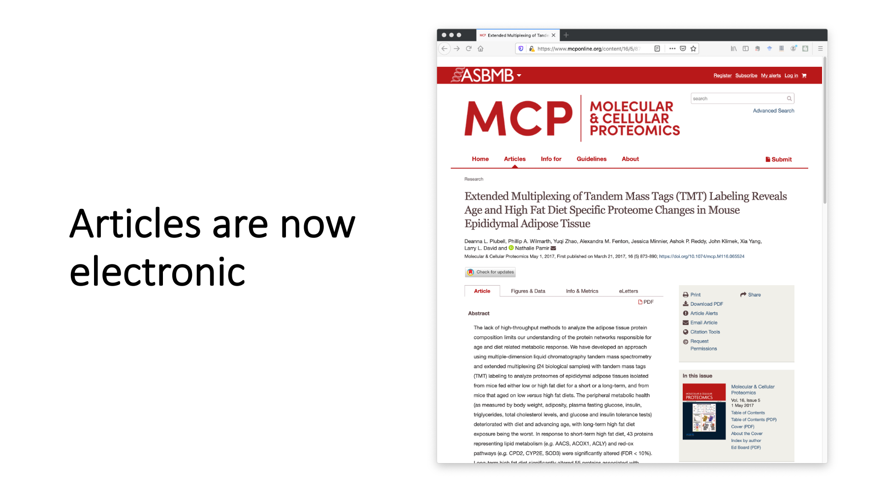
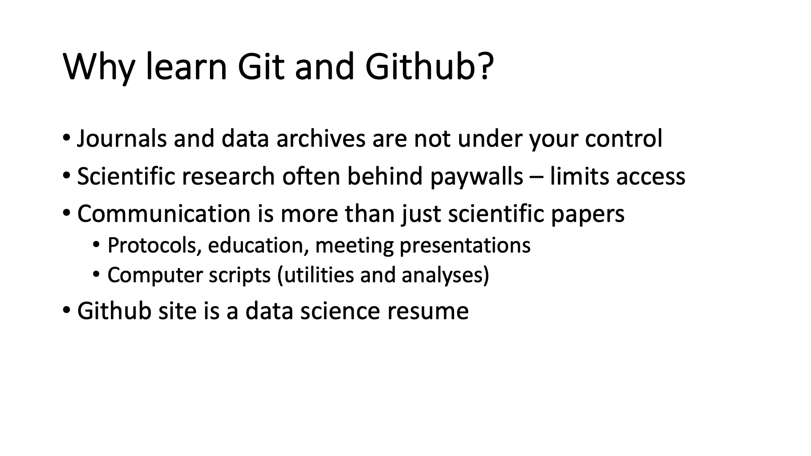
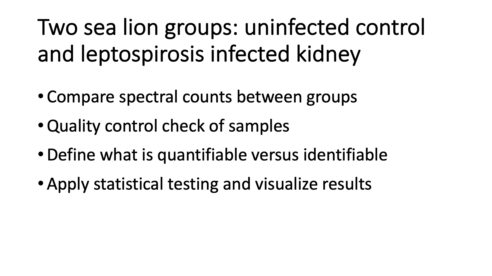
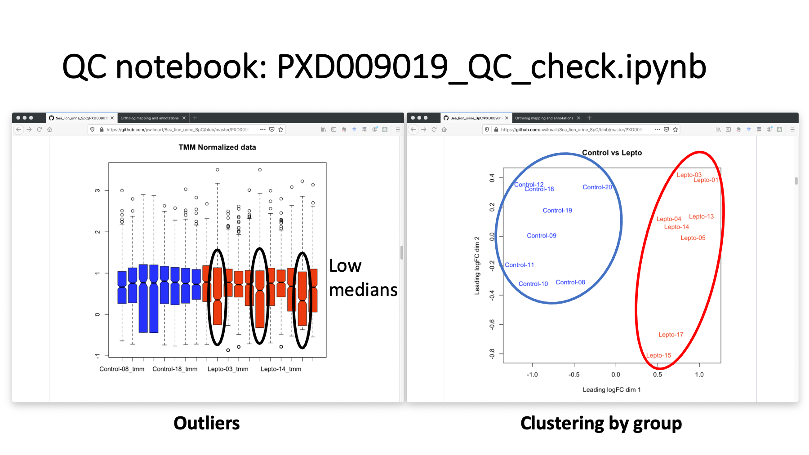
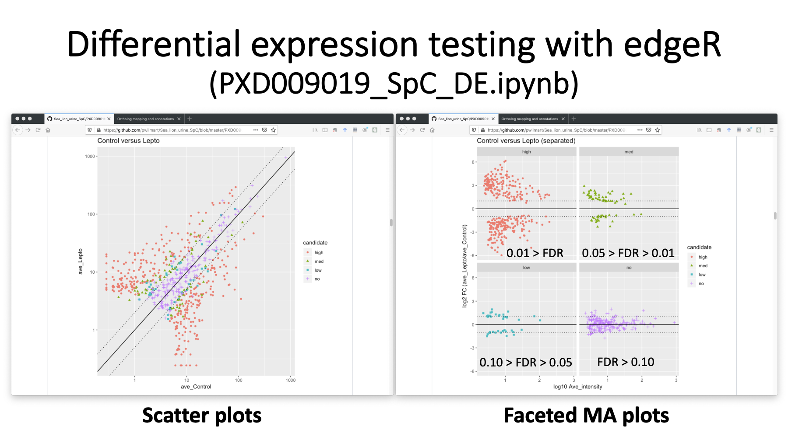
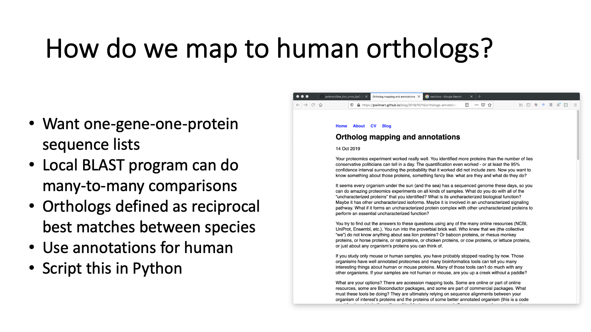
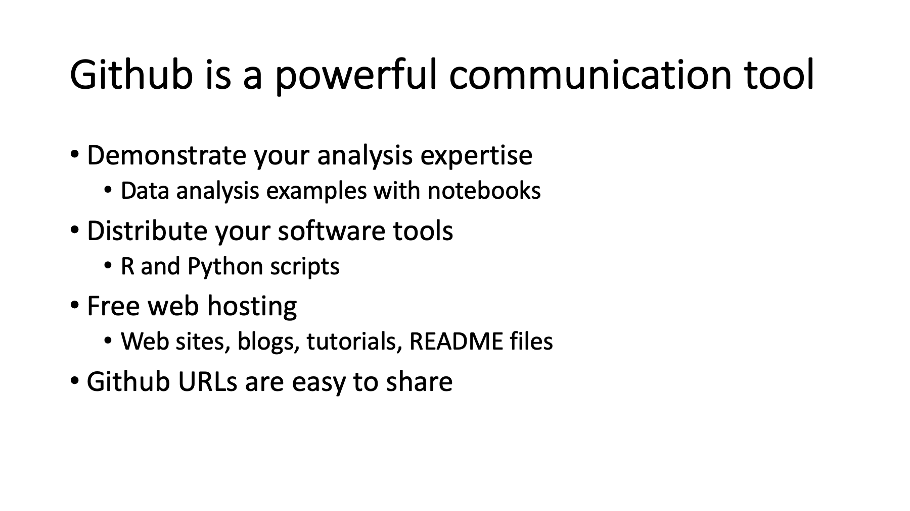

# ABRF 2020 Meeting

# Github: a powerful resource for scientific communications

## talk presented by Phillip Wilmarth, OHSU

---

### ABRF 2020: Empowering Team Science
February 29 - March 3  
Palm Springs, California

#### Proteomics Data Science: Online Data resources
Monday, March 2, 3:30pm - 5:00 pm

[ABRF website](https://abrf.org/)

---

_slide 1_

I would like to thank the organizers for this opportunity to tell you about using Github for scientific communication. Github is not a proteomics resource like UniProt. Github is something that you can use to create **your own proteomics resources**.

---

_slide 2_

The center piece of scientific communication is the publication. They used to be printed on paper.

---

_slide 3_

Now everything is electronic – journals and papers. Here is a 2017 MCP paper where the IRS normalization method for multi-plex TMT experiments was first described. We have the article in there somewhere, but there is a lot screen real estate devoted to other things.

Link to MCP article: [Plubell, et al.](https://www.mcponline.org/content/16/5/873.short)

---

_slide 4_

A scientific publication now consists of many parts. We have the main article. We can skip to the figures or tables. There are links to supplemental files. We have extra methods, figures, and data tables for this paper. There are metrics like social media activity, views, and downloads. We also have associated data in archives and repositories. Is there a better way to integrate all this information?

---

_slide 5_

This Atlantic article from a couple of years ago claims that the scientific paper is obsolete. The article was about how notebooks could replace scientific papers.

Link to [Atlantic article](https://www.theatlantic.com/science/archive/2018/04/the-scientific-paper-is-obsolete/556676/)

---

_slide 6_

The Atlantic article was about Mathematica notebooks and open source Jupyter notebooks. These notebooks are web server applications with some connection to a local programming environment. You create and interact with notebooks through web browsers. You can think of notebooks as data analysis stories told through a linear series of cells. These cells can be rich text formatting (like a web page), executable code cells (typically Python or R), and the output (graphics and text) from the code cells. I mostly use Jupyter notebooks, but R Markdown is similar. Notebooks are perfect for data analysis stories.

[Jupyter notebooks](https://jupyter.org/)  
[R Markdown](https://rmarkdown.rstudio.com/)  
A talk I gave about notebooks at [Cascadia in 2018](https://github.com/pwilmart/Cascadia_2018)

---

_slide 7_

I think that life science research is too complex to replace with notebooks. However, the computational steps in research projects are hard to describe with just text. Notebooks are much better ways to describe these steps. Computational steps are only part of the story for most life science research, so notebooks can augment instead of replace papers. Adding notebooks to the supplemental files makes sense. It turns out that notebooks, version control, and Github all go together.

---

_slide 8_

Alright, we are finally talking about Github! It is the world’s largest software hosting service and uses Git distributed version control. Github has grown rapidly and is enormous. Github has strong support for Jupyter notebooks and hosts about 6.4 million notebooks currently. Github has a lot of additional functionality: it facilitates collaborative work on software (and other) projects, it acts like a syncing service to protect your files, and it supports web content creation and hosting.

[Wikipedia entry for Github](https://en.wikipedia.org/wiki/GitHub)

---

_slide 9_

When you are trying to learn about Git and Github, it helpful to have a mental picture of how the pieces connect. Github itself is a collection of repositories that reside in the cloud. Copies of those repositories are mirrored on your local computers. That is the distributed part. For example, I go to OHSU and work on some code. I work on a local copy of the files in a Git repository. I save my work by committing the changes. I can push those changes to the corresponding Github repo, cycle home, pull the updated code to my home PC, and continue my work. Lather, rise, and repeat. Other users may just be fetching code from the repo to run on their PCs.

An outstanding book: [Happy Git with R](https://happygitwithr.com/)  
[Git downloads](https://git-scm.com/downloads)  
[Free Git book](https://git-scm.com/book/en/v2)  
[main Github site](https://github.com/)  
[Github help](https://help.github.com/en/github)

---

_slide 10_

Git and Github are complicated topics that take some serious time and effort to learn. There are good reasons to make the time investment. Journal articles and data archives are not under your control and will get out of date. The content may also be behind paywalls and limit access. What if you had a protocol described in a previously published paper that has changed? How does the community find the updated protocol? The scientific paper is only part of the professional communication we need to do. The version control and sharing features of Github are great for lab protocols, tutorials, and meeting presentations. If you write scripts to do routine tasks, you can share them with the proteomics community. Data analysis skills are valuable, and the content you have at Github is a way to showcase your skills.

> A way to get around the locked down content at journals and data archives would be to create a Github repository that corresponds to the publication and its associated data archive. You can put the repo URL in the paper text (Methods or Acknowledgements) as a "for updated information about methods and protocols used in this paper see: _Github URL_". That URL could be added to the archive metadata. Maybe use first author and year as the repo name (something unique to the paper but not using the journal name). If you have to resubmit to a different journal, you may not be able to alter the data archive meta data. It might make sense for the first author (or last author) to have a Github account for this. Then you have a mechanism for corrections, addition of overlooked content (like sample keys for TMT experiments), and updated/improved protocols.  

This repo shows you how to [turn meeting content into Github content](https://github.com/pwilmart/talk_to_repo_example)

---

_slide 11_

This is my Github site. There is profile information on the left. You can pin up to 6 repositories to the landing page. I have a couple of repos about IRS data normalization, one for tandem mass tag (TMT) data analysis examples, my proteomics pipeline software, some utilities for managing FASTA protein databases, and even this talk. Each Github account can also have a dedicated website.

https://github.com/pwilmart

---

_slide 12_

Flexible web hosting and content creation is one of the best features of Github. I mostly use my main Github website for some blogging on proteomics topics. Each individual repository can also have an associated web page. The repo web pages are often used for documentation, vignettes, and tutorials. Each repository can also have a README file, written in Github markdown, that gets automatically rendered as web content.

https://pwilmart.github.io/  
More about [Github pages](https://pages.github.com/)

---

_slide 13_

One of the things you can do at Github is demonstrate data analysis topics using publicly available data. Real world examples are a more powerful way to reach your audience. I have an interest in how to analyze data from less common organisms. I heard a presentation from Ben Neely about proteomics on marine mammals at last year’s ASMS meeting. Their group published a paper about California sea lion urine samples to probe kidney disease. When that paper was published, a sea lion genome was not available. They used a combined seal and walrus protein database. The sea lion genome has since been sequenced and I was curious how the results would change if a sea lion protein database was used. I repeated the analysis with the sea lion database and my open source pipeline that uses MSConvert for RAW file access and Comet for database searching.

JPR article: [Neely, et al.](https://pubs.acs.org/doi/abs/10.1021/acs.jproteome.8b00416)

---

_slide 14_

This is the repository for the re-analysis. The URL is at the top. On the left, we have the start of the repository with a description, some tags, and the list of files. Github is designed to be a code repository, so we see the files first with some versioning information. If we scroll to the bottom of the files (on the right), we see the README markdown file displayed as rich web content. We have headers, text, a hyperlink to the data archive, and a list.

https://github.com/pwilmart/Sea_lion_urine_SpC

---

_slide 15_

This is what the contents of the README.md file looks like. Markdown is more concise and readable than HTML source code. It is a little faster and easier to create web content with markdown. Markdown supports many basic web site features: headers, formatted text, hyperlinks, images, list, tables, etc.

The [Atom editor](https://atom.io/) is my favorite for working on README.md files. \<Shift>\<Control>\<M> will show you a markdown preview pane. Super helpful.    
Help page for [Github markdown](https://guides.github.com/features/mastering-markdown/)  
See Adam Prichard's [cheatsheet](https://github.com/adam-p/markdown-here/wiki/Markdown-Cheatsheet)

---

_slide 16_

The README file covers the sea lion analysis steps with my pipeline. It uses the target/decoy method in an interactive and visual way to control PSM FDR. High resolution, accurate mass data is not searched by specifying a narrow parent ion tolerance. Instead, a wider tolerance search is done, and delta masses of the matches are displayed (on the left for 2+ peptides). We set windows on the delta mass peaks and then generate the corresponding conditional score distributions. On the right, we have the score distributions for the 2+ peptides in the zero-Da window. The decoy scores are in red and the target scores are in blue. The left histograms are semi-tryptic peptides and the right are fully tryptic peptides. The dotted lines are 1% FDR cutoffs.

[PAW pipeline](https://github.com/pwilmart/PAW_pipeline)  
[FASTA utilities](https://github.com/pwilmart/fasta_utilities)

---

_slide 17_

The README has many more histograms, lots of descriptions, and summary statistics. There were 19 samples with a total of 1.26 million MS2 spectra. About 250 thousand PSMs passed the 1% FDR thresholds. There were 81% fully tryptic versus 19% semi-tryptic peptides. All biofluids (serum, saliva, CSF, and urine) will have a lot of semi-tryptic peptides. The semi-tryptic peptides were a little more abundant than oxidation. I made a similar walrus and seal database like what was used in the publication and did an analysis using that database. The number of identified PSMs dropped to 142 thousand. Using a sea lion database increased the identifications by 75%.

---

_slide 18_

The study had 8 sea lions without any kidney disease and 11 sea lions with kidney disease from leptospirosis infection. The paper used label free spectral counting to compare the two groups. Any quantitative study should check the data before doing the statistical analysis. How did the data from each sample turn out? Do they all look okay or are some of them possible outliers to be excluded? We can always identify more things than we can quantify. The bar is higher for quantification. How do we determine a cutoff for quantification? After checking the data, we can do the statistical testing and visualize the results. We can do all of this with notebooks.

---

_slide 19_

The repo has a separate Jupyter R notebook to do some basic quality control processing. The control samples are in blue. The infected samples are in red. The boxplots of the spectral count distributions have 3 infected samples with low count distributions. If we drop those, we still have an 8 by 8 comparison. We can also do some clustering analysis. The plot on the right is a multi-dimensional scaling (MDS) plot. The two groups are well separated. There are many other R clustering package options that could also be used.

[QC notebook](https://pwilmart.github.io/TMT_analysis_examples/PXD009019_QC_check.html)

---

_slide 20_

Each biological sample was analyzed in a single LC run. We had close to 2,300 identified proteins. How many of those can we quantify? If we compute the average spectral count per protein for the samples, we can sort our count table by decreasing average counts. We can count the cells with missing data in the table as a function of protein, from the highest abundance to the lowest abundance (the average SpC) and count all the cells. We can plot the average SpC on the x-axis and the fraction of missing data on the y-axis using another notebook. When we get to small average SpC, we see a sharp rise in missing data. The dotted line is an average SpC of 2.5. That has 669 quantifiable proteins. While this is only 30% of the identified proteins, those 669 proteins account for almost 90% of the total spectral counts observed in the experiment. Using such a cutoff eliminates most of the missing data and its complications.

[Quantifiable cutoff notebook](https://pwilmart.github.io/TMT_analysis_examples/PXD009019_average_missing.html)

---

_slide 21_

We used the Bioconductor package edgeR to do the statistical testing in an R notebook. Here are just a couple of the many visualizations. We have a scatter plot on the left with differential candidates colored by some significance cuts. We are using Benjamini-Hochberg corrected p-values for significance. We can also make MA plots (commonly used in genomics) where we have separated the DE candidates. The unchanged proteins in purple have mostly less than 2-fold changes. The orange proteins with FDR less than 0.01 have much larger than 2-fold changes.

[Differential expression notebook](https://pwilmart.github.io/TMT_analysis_examples/PXD009019_SpC_DE.html)  
[edgeR users guide](https://www.bioconductor.org/packages/release/bioc/vignettes/edgeR/inst/doc/edgeRUsersGuide.pdf)

---

_slide 22_

The sea lion database made a big improvement. We identified close to 2,300 urine proteins. We had 400 differential expression candidates. What do we do with the results? We only really have usable annotations for human and mouse among higher eukaryotes. The degree of annotations for other species will be variable. We need to map the sea lion proteins to human orthologs and annotate the sea lion proteins with the corresponding human ortholog annotations.

---

_slide 23_

Mapping protein lists from less common species to human or mouse is something I end up doing all the time. It is a little complicated and was perfect for a blog post. We are basically going to use a locally installed BLAST program to align all sea lion sequences against the human Swiss-Prot database and find the best matches. We will map the human annotation information (genes, keywords, GO terms, and pathways) to the sea lion proteins. There are a lot of steps, so it is safer to let the computer do the work.

[Orthologs blog post](https://pwilmart.github.io/blog/2019/10/14/orthologs-annotations)

---

_slide 24_

I have two repositories with scripts for doing this. One does the BLAST run and makes a summary table. The other gets the human annotation information and maps it to the sea lion orthologs. We start with a proteomics results table from my pipeline and add statistical testing results to the table. Then we add ortholog and annotation columns to the table. At the end, we have a more informative report to send to clients and publish.

[PAW Blast](https://github.com/pwilmart/PAW_BLAST)  
[Annotations](https://github.com/pwilmart/annotations)

---

_slide 25_

Github is a powerful communication resource we can use. We saw how to use a repository to illustrate data analysis concepts on public data. We used Jupyter notebooks to help tell our story. We needed some custom scripts in the analysis that we have available at Github. The site webpage and blog were used in the story telling, as well as Github markdown in the README files. All of this is easy to share with the proteomics community thanks to stable Github URLs.

---

_slide 26_

Thank you for your time and I will take any questions.

---
